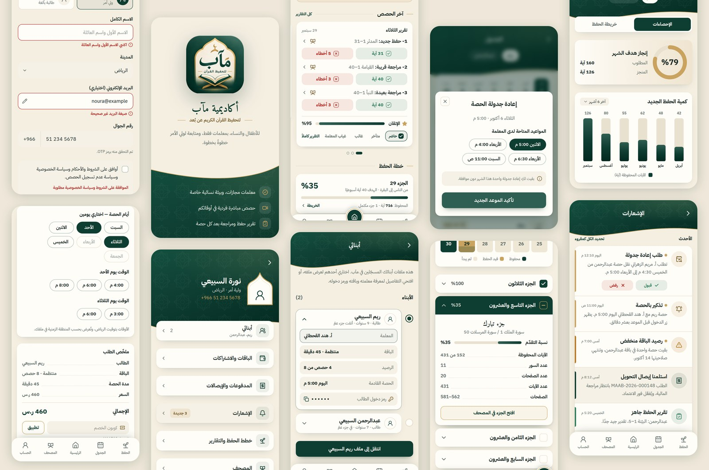

<div align="center">


# أكاديمية مآب لتحفيظ القرآن الكريم

**واجهة الإطلاق الأول (MVP) — فرع `maab-study`**

</div>

منصة ويب عربية لتحفيظ القرآن الكريم عن بُعد، للأطفال والنساء، بمعلمات فقط، والحصص عبر Google Meet.
هذا الفرع يبني الواجهة كاملة وفق «المواصفات التقنية» للأكاديمية، بتخطيط الصفحات وأسلوب التصميم المأخوذين
من الواجهات المرجعية، وبألوان شعار مآب: الأخضر الداكن أساساً، والذهبي للأطر والتمييز، والكريمي خلفيةً.



## التشغيل

```bash
cd maab
npm install
npm run dev        # http://localhost:3000
```

من صفحة البداية تُستعرض الواجهات الثلاث: **ولي الأمر** و**المعلمة** و**الإدارة**.
البيانات في هذه النسخة وهمية تماماً (`src/lib/demo`)، وساعة العرض ثابتة على
الأحد 4 أكتوبر 2026، 1:30 م بتوقيت الرياض، لتبقى الحالات متّسقة (حصة مفتوحة الآن، تقرير متأخر…).

| الأمر | الغرض |
| --- | --- |
| `npm run build` / `npm start` | بناء الإنتاج وتشغيله |
| `npm test` | اختبارات قواعد العمل وجدول الآيات (Vitest) |
| `npm run lint` · `npm run typecheck` | ESLint وTypeScript |
| `npm run quran:data` | يولّد بيانات المصحف والتفسير من `../app/data` (بيانات بُشرى في المستودع نفسه) |
| `npm run content:adhkar` | يستخرج أذكار الصباح والمساء |
| `npm run brand:icons` | يولّد نسخ الشعار وأيقونات PWA من `brand-src/maab-logo-source.png` |

## من المرجع إلى مآب

أُخذ من الواجهات المرجعية **ترتيب الصفحات وأسلوبها فقط**: الرأس الأخضر بحافته المنحنية، والبطاقات
المستديرة، والشريط السفلي بخمسة أقسام والقسم النشط مرفوع، والقوائم بأيقونة في البداية وسهم في النهاية.
أما المحتوى فمن مواصفات مآب:

| نمط المرجع | الشاشة في مآب |
| --- | --- |
| شاشة البداية بالشعار والموجة | `/` البداية واستعراض الواجهات |
| نموذج تعديل الملف بالأخطاء | `/onboarding` إكمال الحساب، `/guardian/children/new` إضافة طالب |
| الملف الشخصي وقائمة الإعدادات | `/guardian/account` و`/teacher/account` بإطار المحراب الذهبي |
| «درس اليوم» بالشرائح والحضور | `/guardian` الحصة القادمة وآخر التقارير والخطة والواجب |
| قائمة الطلاب بالاختيار والتفاصيل | `/guardian/children` و`/teacher/students` |
| نافذة فوق خلفية ضبابية | إعادة الجدولة والإلغاء بقواعد 12 ساعة، رفض التحويل بسبب |
| المستويات وتفاصيل الجزء | `/guardian/progress/map` خريطة الأجزاء الثلاثين |
| الحلقة الذهبية والأعمدة | `/guardian/progress` هدف الشهر وكمية الحفظ |
| الإشعارات بالقبول والرفض | `/guardian/notifications` |
| خطة التسميع وأيام الحلقة | `/guardian/plans/checkout` الأيام والأوقات، `/teacher/availability` |

وبقية الشاشات: الباقات `/guardian/plans`، الدفع بالتحويل `/guardian/payments/[ref]`، تقرير الحصة
`/guardian/reports/[id]`، كتابة التقرير للمعلمة `/teacher/sessions/[id]/report`، المصحف
`/guardian/mushaf/[page]`، الأذكار `/azkar`، طلب الانضمام `/join`، السياسات `/legal/[slug]`،
ولوحات الإدارة `/admin` و`/admin/payments` و`/admin/teachers`.

## الهوية البصرية (القسم 16)

- الرموز اللونية في `src/app/globals.css` بقيمها في الوضعين الفاتح والداكن كما في جدول المواصفات،
  والوضع الداكن تلقائي حسب الجهاز مع زر تبديل في الحساب.
- الخطوط: IBM Plex Sans Arabic للواجهة، Amiri للعناوين البارزة، Amiri Quran لنص المصحف
  (خط مجمع الملك فهد يُضاف بعد مراجعة ترخيصه).
- عناصر الشعار: القوس المحرابي بإطاره الذهبي (إطار الملف الشخصي)، الخطان الذهبيان حول العناوين،
  نصف القطر 16 للبطاقات و12 للأزرار، الرحل والمصحف لأيقونة المصحف، النمط الهندسي بشفافية خافتة في الرؤوس فقط.
- RTL بالخصائص المنطقية، والأزرار الرئيسية بارتفاع 48 بكسل، والنص الذهبي بدرجته الداكنة `--brand-gold-text`
  لا بالذهبي الفاتح، وأوصاف لقارئ الشاشة وتنقّل بلوحة المفاتيح بعناصر أصلية (radio وdetails وdialog).

## ما بُني من قواعد العمل

في `src/lib/domain` مع اختبارات في `__tests__`:

- **الإتقان**: 100 − (3 لكل خطأ حفظ + 1 لكل تجويد أو تشكيل + 0.5 لكل تردد)، والمقطع تحت 70% لا يُحتسب.
- **الحصص**: نافذة الدخول (قبل 10 دقائق وبعد النهاية بـ15)، فاصل 5 دقائق بين الحصص، جدول الغياب والرصيد كاملاً،
  إعادة الجدولة الذاتية مرتين شهرياً، مهلة التقرير 12 ساعة.
- **الباقات والدفع**: الأساسية والمنتظمة والمكثفة وحدود الترحيل، الرقم المرجعي `MAAB-2026-000123`،
  حجز 72 ساعة، مسار حالات التحويل والسبب الإلزامي للرفض، الكوبونات.
- **المعلمات**: مراحل القبول الست، المستندات، الإيقاف بعد ثلاث غيابات دون عذر.
- **المراجعة المتباعدة**: يوم، 3 أيام، أسبوع، أسبوعان، شهر.
- **جدول الآيات المرجعي** (`src/lib/quran`): 6236 آية، الأجزاء بحدودها الدقيقة حتى ما يبدأ منها وسط الصفحة،
  وحساب المقادير من نطاق الآيات، وبحث يتجاهل التشكيل (`GET /api/v1/quran/search`).

## المصحف

صفحات مصحف المدينة الـ604 بأسطرها الخمسة عشر، والتفسير الميسّر لآيات كل صفحة، وعلامة مرجعية وموضع
القراءة الأخير. عامل الخدمة (`public/sw.js`) يُبقي المصحف والخطوط عاملة دون اتصال بعد الفتح الأول.
النص مأخوذ من بيانات تطبيق بُشرى في هذا المستودع؛ والمواصفات تنصّ على نسخة Tanzil العثمانية، فتُراجَع
شروط الترخيص والمصدر المعتمد قبل الإطلاق (مهمة «قبل البناء» في القسم 10).

## ما يأتي بعد هذه الواجهة

الواجهة تقرأ من `src/lib/demo/queries.ts` وحده، فيُستبدل بطبقة `/api/v1` دون تغيير الشاشات:

1. مخطط قاعدة البيانات بـDrizzle (52 جدولاً) مع سياسات RLS وقيود `EXCLUDE` و`CHECK` واختباراتها.
2. Supabase Auth برمز OTP عبر مزوّد SMS سعودي، وGoogle OAuth، وجلسات بكوكيز HttpOnly.
3. العامل الخلفي (pg-boss) لإنشاء روابط Meet عبر Calendar API والتذكيرات وانتهاء الباقات.
4. رفع الملفات إلى Buckets خاصة بروابط موقّعة، ومحرك الإشعارات (داخل المنصة، Push، البريد، SMS).
5. التصدير PDF وExcel، وواجهة إنجليزية، وإعادة رسم الشعار SVG بدقة الطباعة.

راجع `AGENTS.md`: نسخة Next.js هنا (16) تختلف عن السابقة، ووثائقها في `node_modules/next/dist/docs`.
